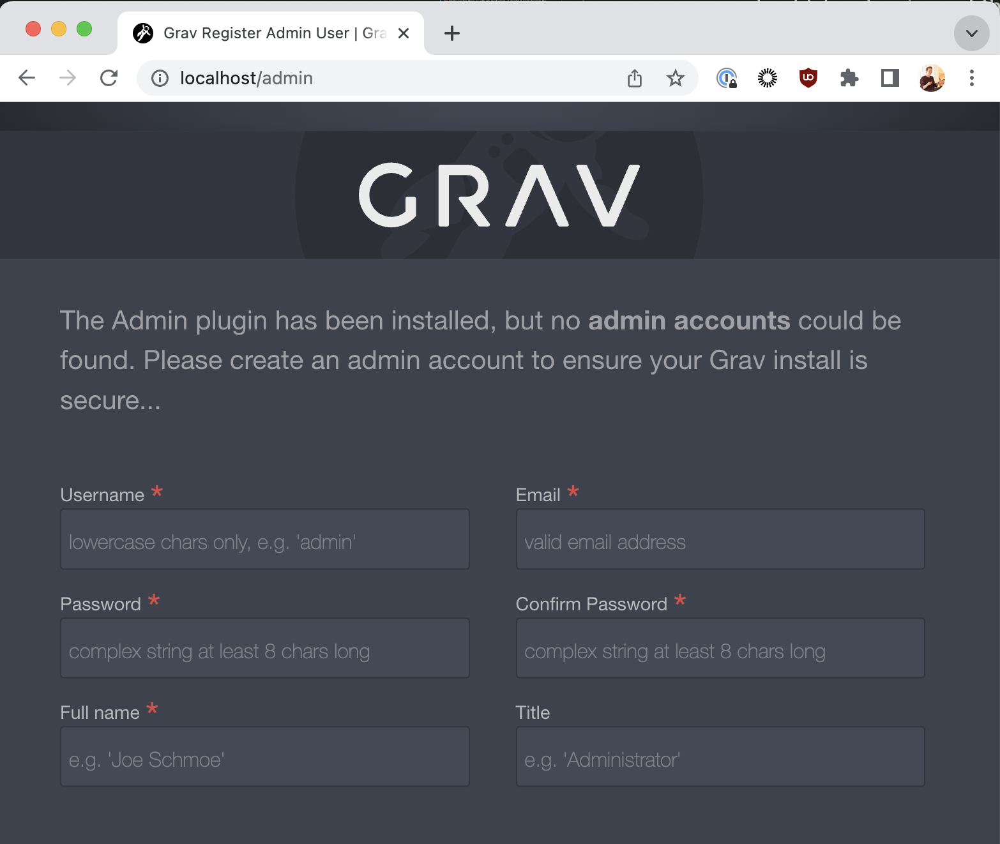

# Blog-Post Markdown Webhosting With AWS

## Starting the journey
It's a little bit humbling coming from a game development background, and realising how little overlap there is with web development. I decided I would document the process.

### Requirements

Broadly I wanted my website to support 3 main types of content.

1. Blog posts
* Each blog post would be focussed around game developmend, containing mixed media, technical documentation, and inline Uniy WebGL Demos.
2. Unity WebGL Demos
* The main though was to start learning and deep-diving into Unity WebGL and sharing some findings that others could lean on or learn from
3. My CV
* Converting my existing Wix.com personal site over.

For this post, I'm going to focus primarily on how I setup the Blog. In the future I'm going to deep dive more the Unity WebGL hositng side. But the foundation covered here will make it easier to reason about.

### Getting a web server up and runnning

#### Choosing the Tech Stack

Having worked with some more web savvy folk in the past, I was aware that a blog falls into the technology umbrella of *Content Management System* of which there are money. An example being Wordpress which powers a lot of personal sites. So again I started at figuring out my requirements:

1. Blog written in MarkDown
* I decided I wanted to utiilise MarkDown for the more blog style pages - aside from being a RichText editor, it supports a few different features I need (Namely Latex and iFrames) as well as meaning I wasn't tied in to needing to author on a particular CMS platform, which I valued as I knew I would probably make at least a couple of mistakes when deciding on the hosting stack, and being able to just point at an MD file that I am iterating on in Git would allow me to avoid dependencies between content and solution.

On researching MD CMS systems, I came across Grav https://learn.getgrav.org/ a siplified CMS system 

> "There are many powerful open source CMS solutions for building complex websites. Some of the more commonly used ones are Joomla, WordPress, and Drupal. The downside of these platforms is that they have a steep learning curve associated with them. This requires a significant amount of your time - and this may be the time that you do not have."

2. A Webserver
* Thankfully after deciding on Grav, this was an easy follow on decision, Grav has an official docker image (more in this later) which configures an Apache webserver to serve the content. The internet generally seems to rave about NGINX webserver, so at some stage I may revisit this.

3. A Web host
* The Web server needs to ultimately run on metal somwhere. In addition to just the Markdown Blogs, to support embedding WebGL content in Markdown Blog posts, I was expecting to utilise \<iFrames\> which effectively embed another webpages content, in your webpage. Antcipating that whatever was serving my WebGL content may live in a different place than the Grav Webserver, I was keen to try to maximise flexibility on the hosting platform.

I decided to pursue learning and adopting AWS. I'd dabled with AWS in the past and knew it would be capable of hosting webservers, as well as being able to upload Unity WebGL to S3, and also was a chance to learn and understand industry leading DevOps services.

4. Storing the Blog Content
* Another simple choice, I was planning to store all of the content for the blog itself, the Markdown files and supporting media, on Gitl

The phrase `Tech Stack` is used in the games industry, but in rarely has the same breadth as the web development world. If you're developing in Unity, often your Tech Stack starts and ends there. However even before I started to do any web development, I had already selected 4 independent technologies which were all going to interleave with one another. So - I started like all developers probably tell you you should, by planning out the solution with an architecture diagram:

Okay, let's actually start diving into the development details. And recap the overall plan:

1. Author and upload a Markdown file to Git
2. Edit the docker image provided by Grav to clone blog content into its pages folder
3. Push the docker image to a container registry living on AWS services (specifically ECR)
4. Utilise more of AWS services to spin up a server, propagate the docker image, and provide a public ip address that allows WWW blog access.

!!! I think 
### Docker

Docker introduces a bunch of concepts. But I think the simpliest way I like to think about it is:

A `Docker Image` is a templated linux vritual machine. This template can be easily configured to come have libraries pre-installed, and run commands on this virtual machine as part of the configuration so that it always boots in a certain state.

This Image can then be run on a Container. The Container is kind of the 'Machine' part of 'Virtual Machine'. It manages the expected resources from the Image (i.e. give me a CPU, and give me some Memory) and can map this onto the actual Host OS/Machine.

So by downloading and using the Grav docker image, we are basically rolling out a pre-configured linux box that contains:
* An installation of Grav
* An apache webserver configured to serv Grav

To try this out step by step:

!!! Rider IDE and Visual Studio Code both have competent docker support with syntax highlighting and build/run functionality, I'd recommend trying one out.

1. Install Docker

2. Download the Grav Docker Image

3. Build the Docker Image
`Docker build-f "PATH_TO/Dockerfile" -t grav-docker:latest "grav-docker"`

4. Run the Docker Image
`docker run -p 80:80/tcp grav-docker:latest`
Let's break this down slightly
    * `docker run grav-docker:latest` - Tell Docker you want to run the image that was just built.
    * `-p 80:80/tcp` - Map port 80 on your host machine, to port 80 in the docker Image, using the TCP protocol. This is what allows us to access the website running in the docker Image.

5. Navigate to `http://localhost/` in a browser - if succesfull it should redirect and show:



Great! You know have Docker Container running your DockerImage, which runs the Apache Webserver, serving the Grav CMS system Already complicated! Let's keep going...

### Get Blog content from Git

1. Create and commit a hello world MD file, or use : [helloWorld.md](helloWorld.md) to your git repository
    ``` 
    # Hello World Title 1
    ## Hello World Title 2
    ### Hello World Title 3
    ```
2. Commit this to your git repository
3. Adjust the Docker instructions to clone your repository into docker

First of all we need to install `Git` into the Docker Image - to do this find the line which is installing the tooling: 

    # Install dependencies
    RUN apt-get update && apt-get install -y --no-install-recommends \

And add on a new line:
    
    git \

Now we can add a command after Grav has been setup, to clone the content we care about:

    # Clone the content Git repo into a new folder under /user/
    RUN git clone https://github.com/matt-website/blog.git /var/www/html/user/git-blog

Finally we copy this content into the local Grav uses to serve:

    # Copy the content from the Git repo into the /user/pages dir, this
    # is the directory Grav builds and serves its HTML with
    RUN cp -r /var/www/html/user/git-blog/* /var/www/html/user/pages

Now that our instructions have been modified, we're going to rebuild and rerun our docker image and verify the results

!!!! One of the advantages of having our content managed in Git is from this point forwards we can do a Git Fetch in the running container to update our blog. More on this later!

Hi Fives all round! We're now onto the next stage of deploying this image onto an AWS service, and browsing to it from the outside.

# AWS

### MORE TECHNOLOGIES

AWS (to a game developer) is a complex beast. There're a huge amount of services that exist on it, a giant tool box of 'web related stuff I geuss' that is daunting to learn and understand. The more I utilise it, the more I appreciate the role of a solutions architect.

Our technology stack from before was a little oversimplified, it missed the various services we're about to setup. But after we're through it should come together in a cohesive way.

There are also multiple ways to configure and run servies on AWS. You can of course configure everything through the AWS website, provision resources, run services. You can also use the AWS CLI, which allows you to perform all these operations as commands. And you can use higher level languages to code your AWS infrastructure, which builds on top of the AWS SDK. This approach is known as `Configuration as Code` and we are going to be using Pulumi to achieve our goal.

Pulumi itself has SDKs in mutliple programming languages. We'll be using typescript here, but if you're more comfortable in another langauge it's mostly a 1:1 mapping of commands.

1. Register for an AWS account
2. Install the AWS SDK and verify you can connect with the command line
3. Install pulumi
4. Follow the pulumi typescript hello world example for basic familiarisation.

Okay, so now let's dive into the typescript pulumi code that creates our Infrastructure.

#### Elastic Container Repository
    const repo = new awsx.ecr.Repository("grav-repository",
    {
        forceDelete: true, // ensure we cleanout the image if we need to
    });
    
The first thing we're setting up is the repository that we can upload our Docker Image to. Amazons repository service ECR is designed to run in conjunction with their other servies, so if our image is contained in an ECR repository, we can easily deploy it onto a virtual machine (EC2 or Kubernetes services).

#### Uploading Docker Image to ECR

    const image = new awsx.ecr.Image("grav-image", 
    {
        repositoryUrl: repo.url,
        path: "../grav-docker/"
    });

This uploads the image and places it in the newly created repository, `path` is relative to where pulumi runs, and it wants the location of the folder containing the Dockerfile. `repositoryUrl` We use from the repository we just created. - if the image is not already built, pulumi will build it for us (making image updates slightly easier)

    const cluster = new aws.ecs.Cluster("grav-cluster");

#### Application Load Balancer

    const alb = new awsx.lb.ApplicationLoadBalancer("grav-lb",
    {
        defaultTargetGroup: 
        {
            healthCheck:
            {
                matcher: "200,302" //add redirect code to good responses
            },
            targetType: "ip",
            port: 80,
            protocol: "HTTP"
        }
    });

https://www.pulumi.com/registry/packages/aws/api-docs/lb/targetgroup/#targetgrouphealthcheck

The ApplicationLoadBalancer handles a number of asepcts of ultimately creating us a browsable website. Let's talk through where I've deviated from the defaults in a little more detail.

        HealthCheck = new TargetGroupHealthCheckArgs()
        {
            Matcher = "200,202,302",
        },

In order to validate the resources provisioned are still functioning correctly. The Load Balancer will perform a what's known as a 'health check'. By default is simply performs an HTTP GET to the target, and if it receievs a `200 OK` response code, the health check passes. If a target is failing its HealthCheck, the LoadBalancer may redirect traffic to other nodes, de-provision and try to re-provision the target / group.

In our case the default settings are problematic for the health check, the Grav webserver performs redirection, on initialisation to the admin page to setup an account for the first time, so the healthcheck returns a `302 Found` code, which fails the health check.

We have modified the `Matcher` property to accept response codes such as the 302 redirect. This means our target group will validly pass the health checks and not be shutdown. 

Similar to our local grav deployment, we expose port `80` for inbound HTTP connections.

#### Roles

Not going to lie, specifying the roles tripped me up initially. When I first was creating this pulumi script and testing my deployments, the roles being used were default built in roles into AWS that cover the basic cases of running services. However we have an additional requirement I haven't mentioned before now.

After our server is up and running, we want to be able to remote into it, and run commands, such as Git Fetch, so that we can easily keep the blog up to date. Docker allows you to do this via `docker exec` however our running image is not exposed directly on AWS. Amazon do provide an ability to do this via `aws ecs execute-command`. But to allow this, the roles which are used with the Tasks need permissions to use `ssmmessages` which is how AWS ultimately calls `docker exec`.

##### Assume Role Policy

    function GetAssumeRoleJSON():string
    {
        return JSON.stringify({
            Version: "2012-10-17",
            Statement: [{
                Action: "sts:AssumeRole",
                Effect: "Allow",
                Principal: { // Allow any of these services to assume thisrole
                    Service: [
                        "ec2.amazonaws.com",
                        "ecs-tasks.amazonaws.com", // We need ECS-tasks for execution
                        "ecs.amazonaws.com",
                        "logs.amazonaws.com", // Logging to cloud watch
                ]
                },
            }],
        })
    }

This role policy is fairly simple. sts:AssumeRole with a list of services essentially allows things running on those services to take on the Role if they need to. Essentially granting permission to activites the services are running (which do not run as an AWS user). Here we allow 4 services to use this role.

##### Permissions Policy

    function GetTaskPolicyDocu(inputName:string): Policy
    {
        return new aws.iam.Policy(inputName, {
            path: "/",
            description: inputName,
            policy: JSON.stringify({
                Version: "2012-10-17",
                Statement: [{
                    Action: 
                    [
                        "ssmmessages:CreateControlChannel",
                        "ssmmessages:CreateDataChannel",
                        "ssmmessages:OpenControlChannel",
                        "ssmmessages:OpenDataChannel",
                        "ecr:*",
                        "ecs:*",
                        "logs:*",
                        "logs:CreateLogStream",
                        "logs:PutLogEvents",
                    ],
                    Effect: "Allow",
                    Resource: "*",
                }],
            }),
        });
    }

So now we are specifying the actual permissions that the Task Role and the Task Execution Role are allowed to do

    "ssmmessages:CreateControlChannel",
    "ssmmessages:CreateDataChannel",
    "ssmmessages:OpenControlChannel",
    "ssmmessages:OpenDataChannel",

This gives the Task permission to start the SSM agent on the Task, which will allows us to `execute-command`

    "ecr:*",
    "ecs:*",

ECR permissions are required to get the image
ECS permissions are required to provision the virtual machine to deploy the image

    "logs:*",
    "logs:CreateLogStream",
    "logs:PutLogEvents",

Allows logging to the Cloud Watch service.

#### Servce

    const service = new awsx.ecs.FargateService("grav-service",
    {
        cluster: cluster.arn,
        assignPublicIp: true, // This makes it browsable
        enableExecuteCommand: true, // This allows us to run commands after it's started.
        taskDefinitionArgs:
        {
            taskRole:{ roleArn: taskRole.arn },
            executionRole:{ roleArn: executionRole.arn },
            container:
            {
                image: image.imageUri,
                cpu: 512, // 0.5
                memory: 512,
                essential: true,
                portMappings:
                [
                    { targetGroup: alb.defaultTargetGroup }
                ],
                logConfiguration:
                {
                    logDriver: "awslogs",
                    options: { 
                        'awslogs-group':  loggroup.name,
                        'awslogs-region':  aws.Region.EUWest2, 
                        'awslogs-create-group':  "true",
                        'awslogs-stream-prefix':  "example"
                    },
                }
            }
        }
    })

The Service defunes a number of things

    cpu: 512, // 0.5
    memory: 512,

Our upper limits for CPU and RAM on the virtual server spun up by Fargate. Fargate scales up and down resources as demand increases, these numbers are a cap on the scaling to ensure we don't exceed. The Fargate services are priced by the CPU and RAM usage, so keeping these within limits is essnetial to ensure we don't grosly overspend.

### Running Pulumi

We're now ready to call pulumi, setup the infrastructure, after which the Service we have defined will automatically spin up a Task, which in turn will run our image, and we should be able to browse to our load balancers public IP, as well as start a terminal in our tasks running container. Let's test this all out!


<details>
  <summary>Click me</summary>

  tes
</details>

<div>
  <iframe id="inlineFrameExample"
      title="Inline Frame Example"
      width="300"
      height="200"
      src="https://commons.wikimedia.org/wiki/File:HelloWorld.svg">
  </iframe>
</div>