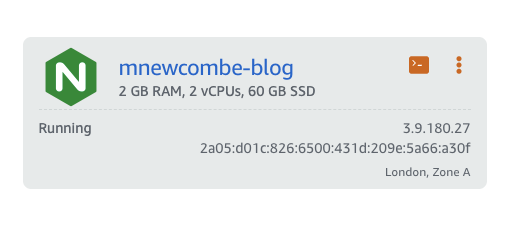
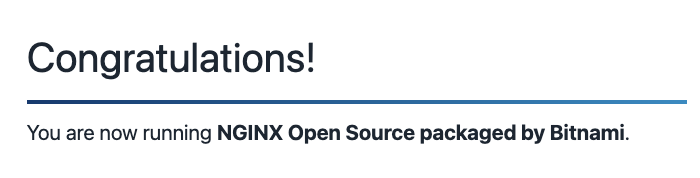

Wow - well, the Docker -> Pulumi -> EC2 etc route turned out to be SO much more complicated than I was expecting and I simply couldn't get it working in a reasonable time threshold

# Setting up Lightsail

First decide if your webserver requires persistent storage or not. You can use Docker with Lightsail, but there is no way to attach storage to the running containers. As I knew I wanted the blog to have persistant data over restarts, I opted to use the standard service.

## Creating an instance

As we know we want to use Grav, we're going to create an instance using a NGINX webserver base bitnami image.


[Bitnami](https://docs.bitnami.com/aws/infrastructure/nginx) is a OS packaged image service that comes pre-installed with various software and services to make it more conveniant to deploy an instance.

!!!! Note a definitive downside of Bitnami is that install locations for software are very non-standard, be careful when trying to follow any online guides for setup and config as often locations will need to be edited, there'll be a few examples of that in this guide.

Then AWS allows a simple choice of CPU/RAM configuration and the instance can be started.



You should now be able to browse to the public IP and confirm that the webserver is running succesfully



### Setting up the development environment

The instance allows you to connect via SSH - we're going to be making a few changes to files here and there so I'd recommend setting up [remote development via VSCode](https://code.visualstudio.com/docs/remote/ssh) which allows you to browse the filesystem and edit files as if it were a local directory - as well as open a terminal instance. It's great for iteration speed.

To set this up you initially want to download your SSH key for the bitnami user from the Lightsail instance details.

This SSH key after downloading needs its permissions to be more restrictive to be accepted, run:

    chmod 400 LightsailDefaultKey-eu-west-2.pem

Next you can need to setup an ssh connection in your ssh config for VSCode to connect to the remote development environment. Either directly edit your .ssh/config file to add your login details:

```
Host AWS.Instance.Public.IP
  HostName AWS.Instance.Public.IP
  IdentityFile ~/Downloads/LightsailDefaultKey-eu-west-2.pem
  User bitnami
```

Alternatively if you have installed the SSH plugin for VSCode, you can establish this connection via the enter ssh command:

    ssh -i ~/Downloads/LightsailDefaultKey-eu-west-2.pem bitnami@AWS.Instance.Public.IP

VSCode will then prompt you to save the info in a ssh config file, and then allow you to connect.


## Installing Grav

You're now ready to install Grav onto your webserver - it needs a few configuration stages to get up and running:

Download and extract [Grav Core + Admin](https://getgrav.org/downloads) to `/opt/bitnami/nginx/html`

### Configuring NGINX with Grav

Grav does come with a 'default' configuration file for Nginx (located at `webserver-configs/nginx.conf`) however it is configured for a default installation of Nginx and needs a number of adjustments in order to work succesfully. Instead you can follow:

1. Create the file: `/opt/bitnami/nginx/conf/bitnami/grav.conf`
2. Add this code into the file

```
#listen 80;
index index.html index.php;

## Begin - Index
# for subfolders, simply adjust:
# `location /subfolder {`
# and the rewrite to use `/subfolder/index.php`
location / {
    try_files $uri $uri/ /index.php?$query_string;
}
## End - Index

## Begin - Security
# deny all direct access for these folders
location ~* /(\.git|cache|bin|logs|backup|tests)/.*$ { return 403; }
# deny running scripts inside core system folders
location ~* /(system|vendor)/.*\.(txt|xml|md|html|json|yaml|yml|php|pl|py|cgi|twig|sh|bat)$ { return 403; }
# deny running scripts inside user folder
location ~* /user/.*\.(txt|md|json|yaml|yml|php|pl|py|cgi|twig|sh|bat)$ { return 403; }
# deny access to specific files in the root folder
location ~ /(LICENSE\.txt|composer\.lock|composer\.json|nginx\.conf|web\.config|htaccess\.txt|\.htaccess) { return 403; }
## End - Security

## Begin - PHP
location ~ \.php$ {

    # Bitnami installs the php-fpm socket for webserver to this location
    # which is nonstandard
    fastcgi_pass unix:/opt/bitnami/php/var/run/www.sock;

    fastcgi_split_path_info ^(.+\.php)(/.+)$;
    fastcgi_index index.php;
    include fastcgi_params;
    fastcgi_param SCRIPT_FILENAME $document_root/$fastcgi_script_name;
}
## End - PHP
```

3. Delete `/opt/bitnami/nginx/html/index.html`

4. Grant write permissions to the html folder for all users - required to allow Grav admin to create files like settings. `chmod a+w /opt/bitnami/nginx/html/* -R`

5. [Restart the Nginx service](https://docs.bitnami.com/aws/infrastructure/nginx/administration/control-services/): `sudo /opt/bitnami/ctlscript.sh restart` 

You should now be able to browse and see the Grav admin welcome page!


Note a good troubleshooting tip is to check the [Nginx logs](https://docs.bitnami.com/aws/infrastructure/nginx/troubleshooting/debug-errors-nginx/) if you're running into errors or cannot browse to the page after following the above instructions.

